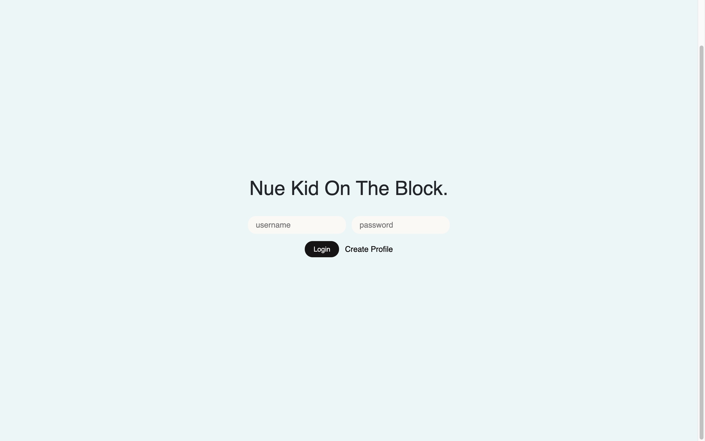
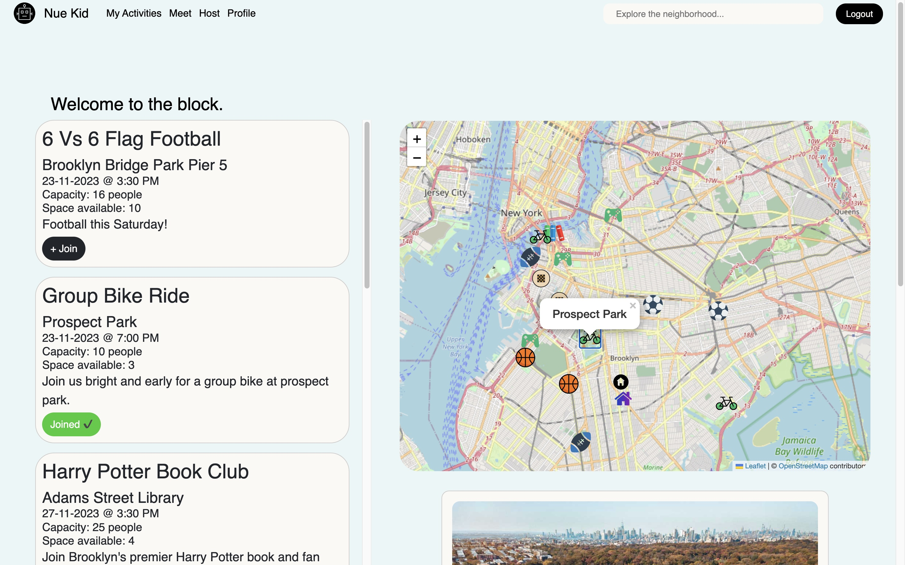
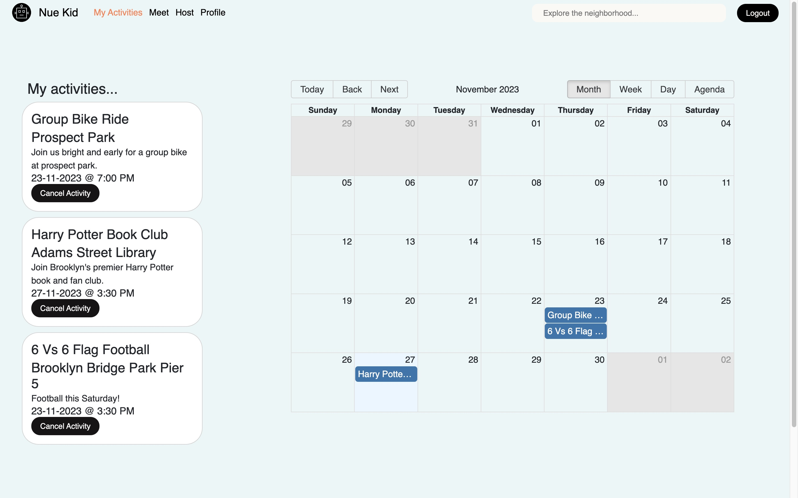

# Welcome to New Kid On The Block!

[View live demo](https://www.loom.com/share/4c00b916bbdd492ea42b845a105953f5?sid=4e31f619-bbaf-444b-b078-36a9236402d1)

## Description

 NueKid is an app that is intended for folks to join as well as host various group meetup's throughout any city or neighborhood. From various activities such as pickup basketball, chess, bike rides, book clubs, etc... users can find their niche anywhere and connect with like-minded individuals. Perfect for those who are new to an area, or simply want to branch out, NueKid allows users to easily find exciting hobbies, while building friendships and community at the same time.

## Setup

To get started fork and clone this repository to your local machine. Then from your terminal navigate into the projects root directory and 'cd' into 'server' and run the following command: 'python app.py' . This should begin our server-side app. Now open up a separate terminal and from the projects root directory run the command: 'npm start -prefix client' . You should now see our app up and running! If log in credentials are needed use 'ez4prez' as the username and 'cats123' as the password. 

## Navigating The App

 

Nuekid is designed to be as intuitive and straightforward as possible. On the home page you will find the map where users can explore different locations around them. These locations host various events. Users are also able to explore events by listings, which appear on the leftside of the screen. Once a user has joined an activity, that activity will show up by its corresponding date on the users calendar page. NueKid also has a page where users can host a new event, as well as a friends page, where users can add and interact with other users. NueKid is a work in progress so stay stuned!

 
 

!!Bugs!!

NueKid is in an early stage of development and not at its full potential! The library used for our calendar feature (react-big-calendar) will break the code if you click on the "week", "day" or "agenda" sections! Please leave it set to "month" (as is the default), This will prevent the app from crashing until that is fixed. Thanks! 